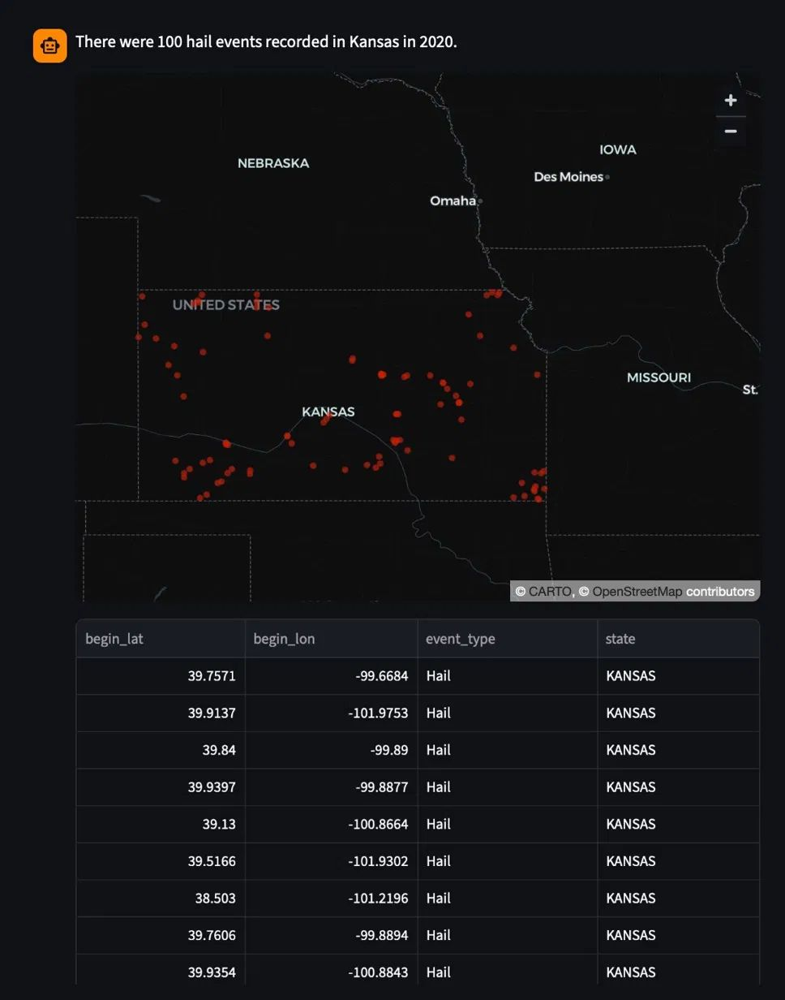
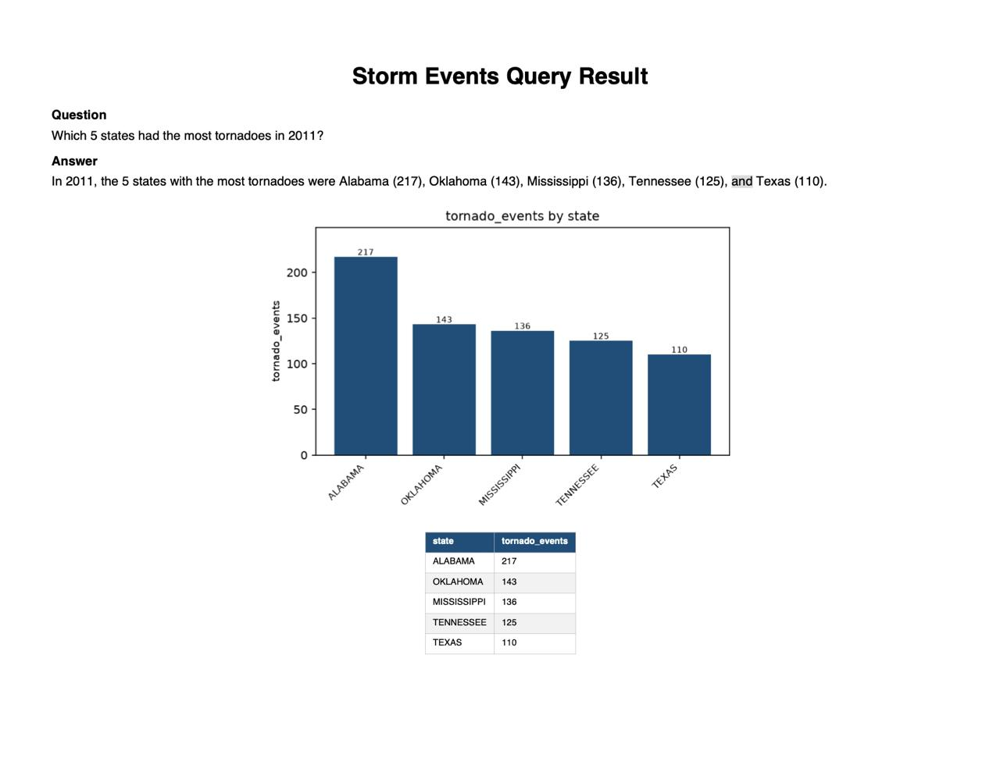
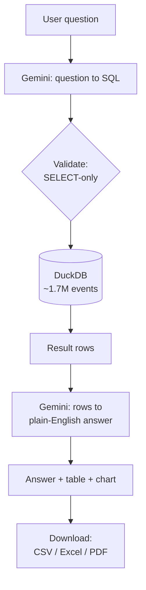

# StormQuery: Text-to-SQL Q&A Chatbot

*Ask 76 years of U.S. severe-weather data in plain English — and get answers backed by SQL, with charts and downloadable reports.*

StormQuery is a natural-language chatbot over the [NOAA Storm Events Database](https://www.ncei.noaa.gov/stormevents/) (~1.7 million events, 1950–2026). You ask a question in English; it translates that question into SQL, runs it against a local database, and returns an accurate, verifiable answer — with an automatic chart or map and one-click export to CSV, Excel, or PDF.

Unlike a typical "chat with your data" tool built on semantic search, StormQuery uses a **text-to-SQL** approach: the language model writes a query and a real database computes the answer. This makes aggregations (counts, sums, rankings) *exact and verifiable* rather than approximate.

---

## Demo

> Add your own screenshots to a `screenshots/` folder using the filenames below.

**Ranking question with an automatic bar chart**


**Map question — events plotted by location**



**Downloadable PDF report (chart embedded, SQL excluded)**



---

## Features

- **Natural-language questions** answered over ~1.7M storm events.
- **Text-to-SQL engine** with a **self-correction loop** — a failed query is retried using the database's own error message.
- **Verifiable answers** — the generated SQL is shown for every response.
- **Automatic visualizations** — a map for location results, a bar chart for rankings and trends, a table otherwise.
- **Downloadable reports** — CSV (raw data), Excel (styled), and PDF (a formatted report with the chart embedded).
- **Safety guardrails** — a read-only database connection *and* a SELECT-only query validator (two independent layers).
- **Data-aware** — flags the 1996 record-completeness boundary (see [Data](#data)).

---

## How it works



1. The question is sent to Google Gemini together with a **schema context** (exact column names, the valid `event_type` strings, example queries, and data rules).
2. Gemini returns a SQL query, which is **validated** to be read-only.
3. The query runs against a local **DuckDB** database, computing the exact result.
4. The result rows are **summarized** by Gemini into a plain-English answer.
5. The answer is shown with an automatic chart and export buttons.

---

## Design decisions

- **Text-to-SQL over retrieval (RAG).** Most questions are aggregations. Semantic search retrieves *similar* rows but cannot return the *complete* set a COUNT or SUM needs, and language models are unreliable at arithmetic over many rows. Translating to SQL makes the answer exact and checkable.
- **DuckDB.** A columnar, in-process analytical database — purpose-built for aggregation queries, with no server to manage. Faster than SQLite on wide-table analytics, and far simpler than PostgreSQL for a read-only, single-user workload.
- **Accuracy comes from grounding.** The model is given the exact event-type values, state casing, example queries, and the 1996 rule — so correctness depends mostly on the supplied context, not on using the largest model.

---

## Tech stack

**Python** · **DuckDB** · **Google Gemini** (`google-genai`) · **Streamlit** · pandas · matplotlib · ReportLab · openpyxl · python-dotenv

---

## Project structure

| File | Purpose |
|------|---------|
| `build_database.py` | Downloads NOAA data, cleans it, builds the DuckDB database + schema context. |
| `engine.py` | Text-to-SQL engine: question to SQL to execute to answer, with guardrails and self-correction. |
| `visuals.py` | Chooses and renders the right visualization (map / bar chart). |
| `exporters.py` | CSV / Excel / PDF export. |
| `app.py` | Streamlit chat interface. |
| `schema_context.md` | Auto-generated schema + value lists that ground the model. |
| `requirements.txt` | Python dependencies. |

---

## Setup

**Prerequisites:** Python 3.10+ and a free [Google Gemini API key](https://aistudio.google.com/app/apikey).

```bash
# 1. Clone and enter the project
git clone https://github.com/akhilsai007/-StormQuery-Text-to-SQL-Q-A-Chatbot.git
cd stormquery

# 2. Create and activate a virtual environment
python3 -m venv venv
source venv/bin/activate          # Windows: venv\Scripts\activate

# 3. Install dependencies
pip install -r requirements.txt

# 4. Build the database (downloads ~76 yearly files from NOAA; one-time, ~5-15 min)
python build_database.py

# 5. Add your API key
echo "GEMINI_API_KEY=your_key_here" > .env

# 6. Run
streamlit run app.py
```

> **Note:** the database (`storm_events.duckdb`, several hundred MB) is **not** committed to the repo — step 4 builds it from NOAA's public data.

---

## Usage

Ask questions in plain English, for example:

- "How many tornadoes hit Texas in 2011?"
- "Which 5 states had the most hail events since 2015?"
- "What was the total property damage from hurricanes in 2005?"
- "Map all tornadoes in Oklahoma in 1999."

---

## Data

Source: [NOAA NCEI Storm Events Database](https://www.ncei.noaa.gov/stormevents/) (1950–2026).

**Record-completeness note:** only tornado, hail, and thunderstorm-wind events are recorded before 1996; all ~50 event types are recorded from 1996 onward. StormQuery flags this when a question spans that boundary, so trends reaching before 1996 aren't misread.

---

## Limitations & future work

- Free-tier API rate limits apply; the model is configurable via `DEFAULT_MODEL` in `engine.py`.
- The in-app map is interactive; the PDF map is a coordinate scatter (avoids heavy geospatial dependencies).
- Descriptive/narrative questions are not the focus — a future hybrid could add retrieval over the event narratives.

---

## Acknowledgements

Built as a Master's capstone project. Data courtesy of NOAA's National Centers for Environmental Information.
